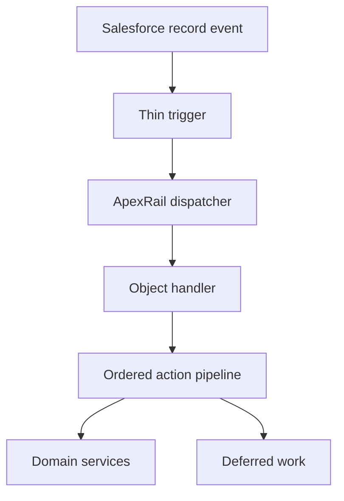

# ApexRail

**Deterministic Trigger Orchestration for Salesforce**

ApexRail is a lightweight Apex trigger framework for building predictable, bulk-safe, testable record automation. It keeps triggers thin, makes execution order explicit, controls re-entry at action-and-record level, and separates transaction logic from asynchronous integration.

> One entry. One route. Explicit actions. Evidence at every junction.

## Why ApexRail?

Salesforce automation becomes difficult to reason about when an object accumulates multiple triggers, embedded business logic, queries in loops, global recursion flags, and direct integration concerns. ApexRail provides a small set of conventions instead of a large application platform:

- one trigger per object;
- lifecycle dispatch through a handler;
- ordered, independently testable actions;
- collection-first APIs and bulk-safe execution;
- action-and-record re-entry control;
- transaction-scoped administrative bypass;
- no dependency on a particular business domain;
- explicit hand-off to asynchronous integration.

## Execution model



## Minimal usage

```apex
trigger AccountTrigger on Account (
    before insert,
    before update,
    after insert,
    after update
) {
    ApexRail.dispatch(new AccountTriggerHandler());
}
```

```apex
public inherited sharing class AccountTriggerHandler extends ApexRailHandler {
    protected override void beforeInsert() {
        ApexRailPipeline.execute(
            new List<ApexRailAction>{ new AccountNameNormalisationAction() },
            context
        );
    }
}
```

See [`examples/account`](examples/account) for a complete example.

## Design boundaries

ApexRail governs Apex record-trigger execution. It does **not** replace Flow, provide an integration transport, or hide Salesforce transaction semantics. External delivery should be handed to Queueable Apex, Platform Events, or another durable asynchronous mechanism after recording transactional intent.

## Documentation

- [Architecture](docs/architecture.md)
- [Execution lifecycle](docs/execution-lifecycle.md)
- [Bulkification](docs/bulkification.md)
- [Recursion and re-entry](docs/recursion-and-reentry.md)
- [Flow and Apex ownership](docs/flow-and-apex.md)
- [Security model](docs/security-model.md)
- [Testing strategy](docs/testing-strategy.md)
- [Asynchronous integration](docs/async-integration.md)
- [Interview guide](docs/interview-guide.md)
- [Roadmap](ROADMAP.md)
- [Architecture decisions](docs/decisions/README.md)

## Project status

The current release is the `0.1.0` foundation. It establishes the public concepts and reference implementation while intentionally keeping the API surface small. See [CHANGELOG.md](CHANGELOG.md).

## Installation

Clone the repository and deploy the core package directory with Salesforce CLI:

```bash
sf project deploy start --source-dir force-app
```

The content under `examples/` is instructional and is not part of the default package directory.

## Principles

1. A trigger detects an event; a domain service understands the business.
2. Execution order is visible in source control.
3. Bulk behaviour is designed into method signatures.
4. Re-entry is controlled narrowly, never by disabling an entire trigger indiscriminately.
5. Security and database access mode are explicit application decisions.
6. A committed business state does not prove successful external delivery.

## Contributing and security

See [CONTRIBUTING.md](CONTRIBUTING.md) before proposing changes. Please report vulnerabilities according to [SECURITY.md](SECURITY.md).

## License

MIT License. See [LICENSE](LICENSE).
