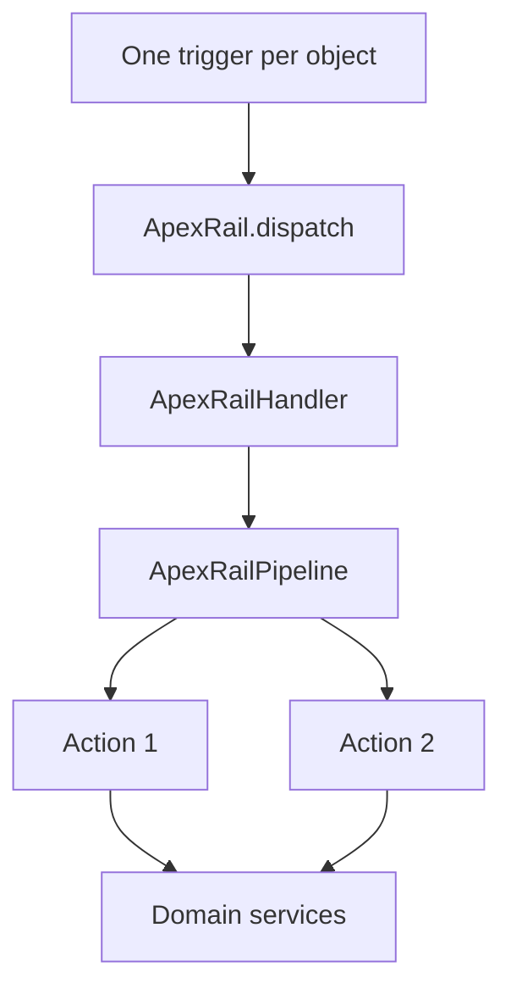

# Architecture

## Purpose

ApexRail provides deterministic orchestration for Salesforce Apex record triggers. It standardises how a trigger enters application code without attempting to own the application’s business rules.

## Components

### Dispatcher

`ApexRail.dispatch` is the small public entry point. It rejects a missing handler and delegates execution.

### Context

`ApexRailContext` captures the trigger operation and old/new record collections. Actions receive the context explicitly rather than reaching repeatedly into static `Trigger` state.

### Handler

An object handler maps lifecycle phases to an ordered pipeline. It coordinates; it does not become a home for all domain logic.

### Pipeline and actions

An action has one method and one reason to change. Source order is execution order. Dynamic metadata-driven class registration is intentionally excluded from the foundation release because compile-time visibility is safer and easier to debug.

### Guard

`ApexRailGuard` remembers processed record IDs per named action for the current transaction. It prevents a duplicate action without suppressing unrelated automation.

### Control

`ApexRailControl` offers transaction-scoped handler bypass. It is not a permanent administrative back door. Persistent permission or metadata controls belong to the consuming application and must be audited.

## Design constraints

- The framework never performs SOQL or DML itself.
- The framework does not make callouts.
- The framework does not infer business transitions.
- The framework does not promise control over Flow or the complete Salesforce order of execution.
- The framework API stays small until real usage proves an extension is necessary.

## Package boundary

Only `force-app` is deployable. The `examples` directory illustrates patterns without installing triggers against standard objects.
