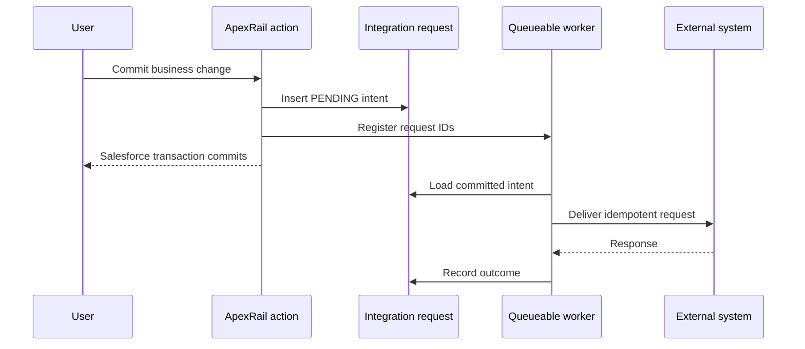

# Asynchronous integration

ApexRail stops at the transaction boundary. A record trigger should not treat a direct remote call as proof of durable delivery.

## Transactional outbox pattern

Suggested statuses are `PENDING`, `IN_PROGRESS`, `SUCCEEDED`, `RETRY_WAIT`, `FAILED`, and `DEAD_LETTER`.

One Queueable is normally sufficient when the trigger transaction creates the request and the Queueable performs the callout before updating the result. Separate jobs are justified when payload preparation requires its own DML transaction, mixed DML must be isolated, aggregation is required, or stages need independent retry policies.

The outbox record should carry an idempotency key, correlation ID, source record, operation, attempt count, next attempt time and sanitised failure information.
