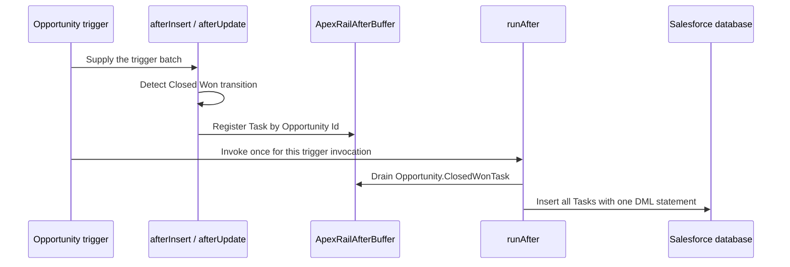

# Opportunity `runAfter()` example

This example creates one follow-up Task whenever an Opportunity is inserted as `Closed Won` or transitions into `Closed Won`.

## Execution

## What it demonstrates

- `afterInsert()` and `afterUpdate()` contain no DML.
- The old and new values identify a transition rather than merely checking the current value.
- Opportunity Id is the deduplication key.
- Re-registering the same key replaces the buffered Task rather than creating another entry.
- `runAfter()` handles an empty buffer safely.
- All buffered Tasks are inserted in one operation.
- The bulk test closes 200 Opportunities.
- An unrelated update to an already-won Opportunity does not create another Task.

## Production considerations

The example uses atomic `insert` so a Task failure fails the surrounding transaction. A production application must choose its failure policy deliberately. Where partial success is acceptable, use `Database.insert(tasksToInsert, false)` and record or surface every failed `SaveResult`.

This example is instructional and remains outside the default package directory. Its metadata companion files are included; copy the files into a Salesforce DX package directory and deploy them to a scratch org to run it.
